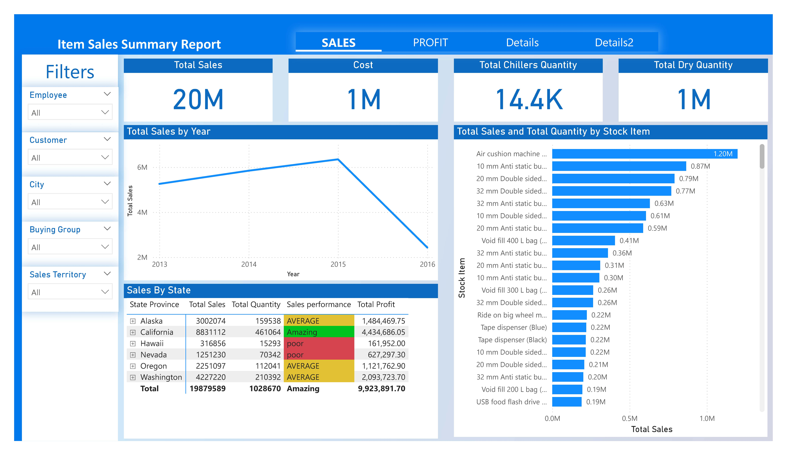

# Item Sales Summary Dashboard

## 🖼️ Dashboard Preview

## Project Overview
This project presents an interactive sales performance dashboard built using Power BI. It provides comprehensive insights into sales, costs, profits, and profitability across multiple dimensions including time, geography, customers, and products.

## Business Objective
The goal of this project is to help stakeholders monitor sales performance, identify profitable products, and support data-driven business decisions.

## Tools Used
- Power BI
- Excel
- Data Visualization
- Business Intelligence

## Key Metrics
- Total Sales: $20M
- Total Cost: $10M
- Total Profit: $9.9M
- Profitability: 49.9%

## Key Insights
- Sales generated a strong profitability rate of 49.9%.
- Washington recorded the highest total sales and profit among all states.
- Profit peaked in 2015 before declining in 2016.
- Several stock items significantly outperformed others in terms of profitability.

## Dashboard Features
- Dynamic filtering by employee, customer, city, buying group, and sales territory.
- Sales and profit trend analysis over time.
- Profit analysis by stock item.
- Geographic sales performance comparison.

## Files Included
- Power BI dashboard file (.pbix)
- Source dataset (.xlsx)
- Dashboard screenshot
- Project documentation

# Author
Ehab Maher Ebrahim
Aspiring Data Analyst
